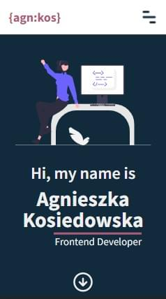
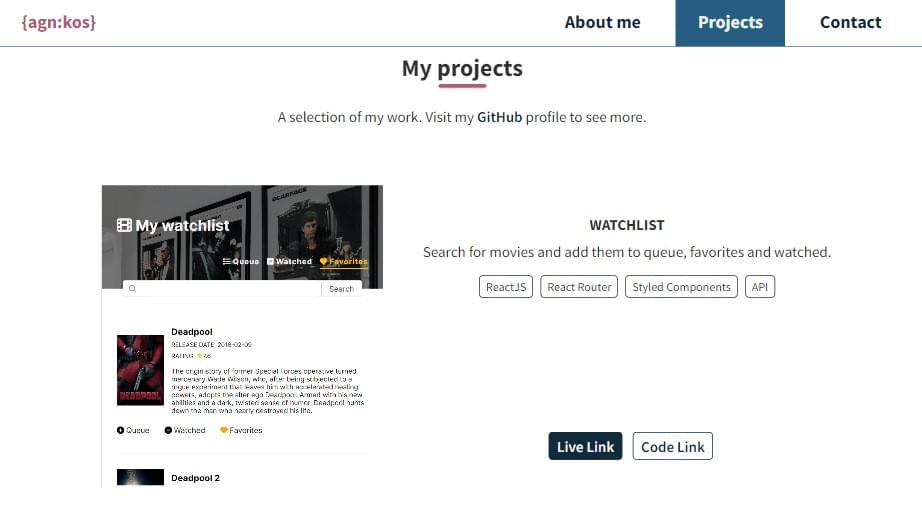

## My portfolio page
## [Project Link](https://agnkos.github.io/portfolio/)

### Project screenshots
 

### Project description
- my portoflio page with links to the selected projects and about me section
- mobile and desktop version
- scrollspy updates links in navigation 
- built with:

